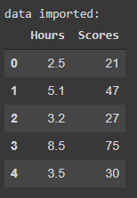
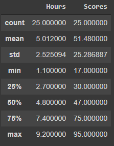
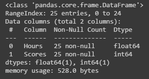
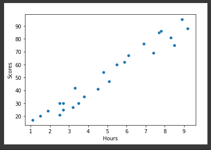
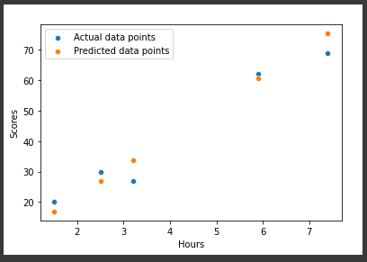
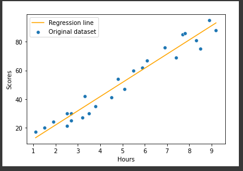

# Supervised Machine Learning

In this project a machine learning maodel was developed to determine the percentage of a student based on the number of study hours.  

## Dataset  

Displaying the first 5 rows of the dataset   
  

### Analysing the dataset   

   

### Checking for any null value in the dataset   

   

### Understanding the relationship between "Hours" and "Scores"   

   

From the above graph it can be observed that "Hours and "Scores" have linear relationship. 
Hence, a simple linear regression model can be trained for predicting the percentage of a student based on the number of hours of study.  

### Linear regression model on test data   

   

### Regression line   

   

The accuracy for the above model is,  
RMSE - 4.65 
On Test data - 0.94 
On training data - 0.95 

From the accuracy scores obtained it can be observed that the model is overfitting the dataset little bit but the overall performance of the model is acceptable.
